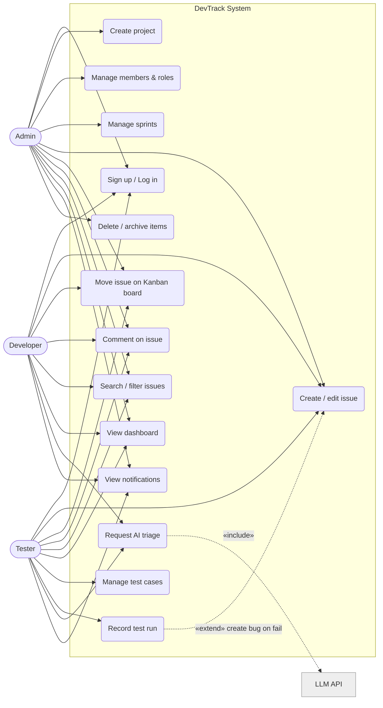
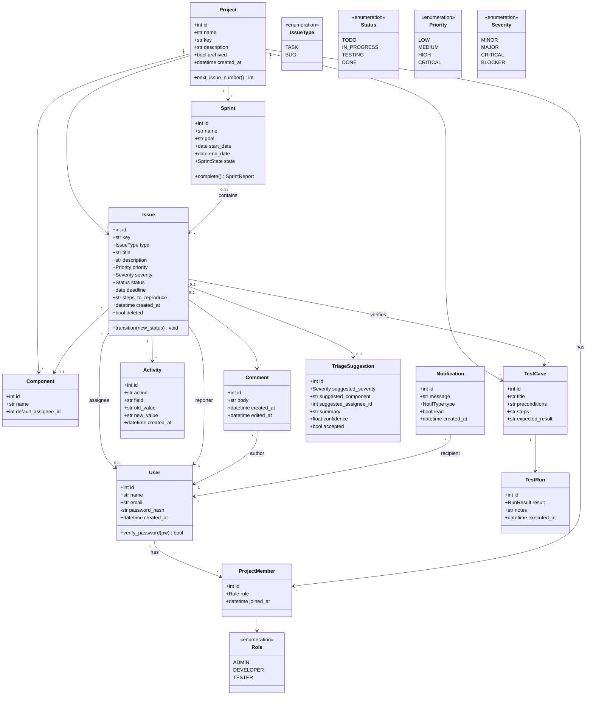
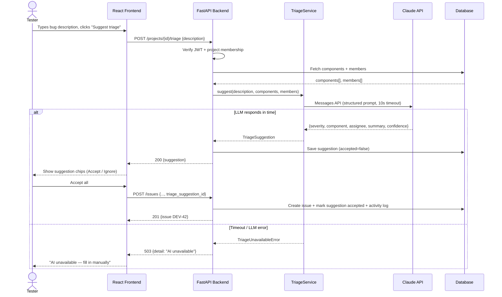
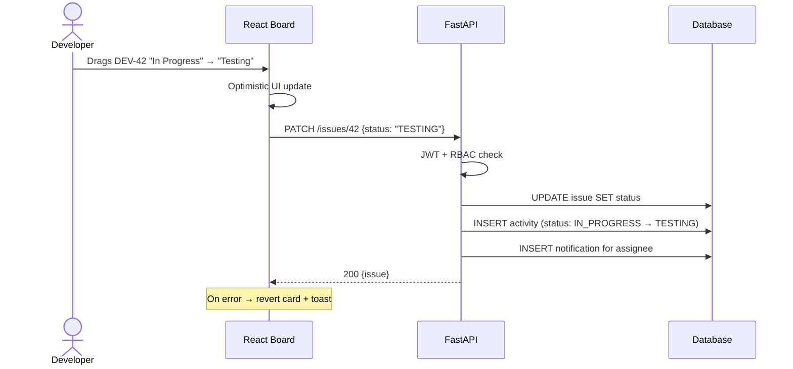
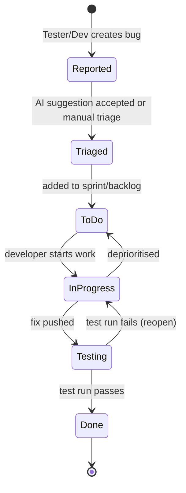
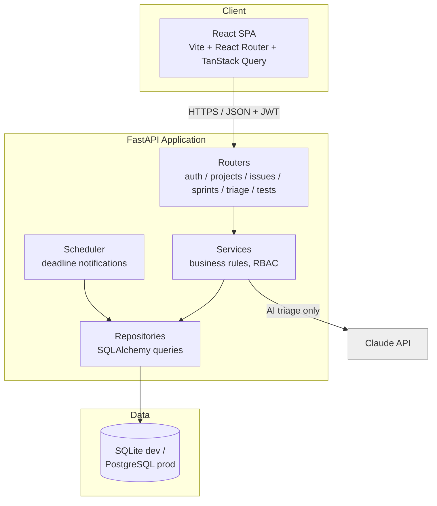

# UML Diagrams — DevTrack

All diagrams are in **Mermaid** format — they render directly on GitHub and in VS Code (with the Mermaid extension). For the college report, export as images via [mermaid.live](https://mermaid.live) or redraw in draw.io using these as the source of truth.

---

## 1. Use Case Diagram

Mermaid has no native use-case syntax, so this is modelled as a flowchart. For the report, redraw in draw.io with standard ovals/actors.

**Key relationships:**
- «include»: *Request AI triage* includes calling the LLM API
- «extend»: *Record test run* extends into *Create issue* when a run fails
- All authenticated use cases include *Log in* (omitted from arrows for readability)

---

## 2. Class Diagram (Domain Model)

---

## 3. Sequence Diagram — AI-Assisted Bug Triage (the flagship flow)

## 4. Sequence Diagram — Kanban Card Move

---

## 5. Activity Diagram — Bug Lifecycle

## 6. Component Diagram (architecture view)

